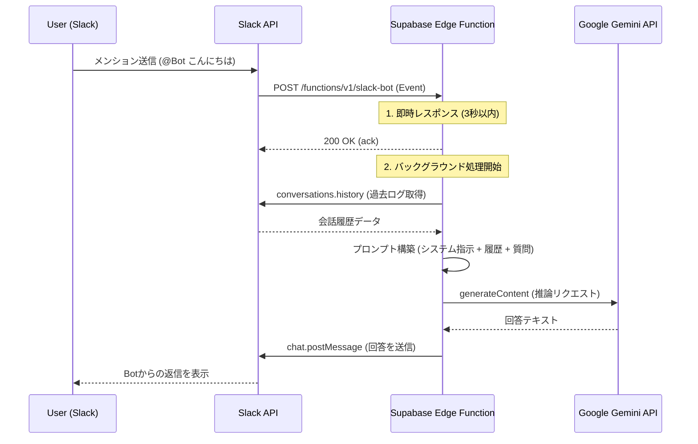

# 🤖 Slack AI Bot (Powered by Gemini & Supabase)

Google Gemini (AI) を搭載したSlackボットです。
Slackでメンションを送ると、過去の会話履歴（文脈）を理解した上で返信してくれます。バックエンドには **Supabase Edge Functions (Deno)** を使用しており、サーバーレスで24時間365日稼働します。

## ✨ 特徴

  * **Gemini搭載:** Googleの最新AIモデル（Gemini 1.5 Flash / 2.5 Flashなど）を使用し、高速かつ自然な日本語で応答します。
  * **文脈理解:** 直近の会話履歴を読み取ることで、「それ」や「あれ」といった指示語や、会話の流れを理解します。
  * **ホワイトリスト機能:** 指定したチャンネルやDMでのみ動作するセキュリティ設計（複数チャンネル指定可）。
  * **サーバーレス:** Supabase Edge Functions上で動作するため、常時起動のサーバー管理が不要でコストパフォーマンスに優れています。

## 🛠️ 技術スタック

  * **Runtime:** [Deno](https://deno.land/) (TypeScript)
  * **Platform:** [Supabase Edge Functions](https://supabase.com/edge-functions)
  * **AI:** [Google Gemini API](https://ai.google.dev/)
  * **Interface:** [Slack Web API](https://api.slack.com/)

-----

## 🔧 技術的な詳細 (Technical Details)

本プロジェクトのアーキテクチャと、実装上の重要なポイントについて解説します。

### 1\. システムアーキテクチャ

Slackからのイベント通知を受け取り、非同期でAI処理を行うサーバーレス構成です。



### 2\. 工夫した実装ポイント

#### ⚡ Slackの3秒タイムアウト対策 (`EdgeRuntime.waitUntil`)

SlackのEvents APIは、リクエスト送信から**3秒以内**にレスポンスを返さないと「タイムアウト（エラー）」とみなされ、リトライ（再送）が発生してしまいます。LLMの推論には通常数秒かかるため、単純な実装ではタイムアウトします。

これを解決するために、**Supabase Edge Functions** の機能である `EdgeRuntime.waitUntil` を使用しています。

1.  Slackからのリクエストを受け取ったら、即座に `200 OK` を返却してSlackを安心させる。
2.  その裏側（バックグラウンド）で、Geminiへの問い合わせと返信処理を実行し続ける。

これにより、タイムアウトエラーを防ぎつつ、重いAI処理を実行可能にしています。

#### 🧠 文脈（Context）の保持

Gemini API自体には「会話の記憶」はありません（ステートレス）。
Botが以前の会話を覚えているように見せるため、以下のロジックを実装しています。

1.  ユーザーから質問が来る。
2.  BotはSlack API (`conversations.history`) を叩き、そのチャンネルの**直近10件の会話**を取得する。
3.  取得した会話を「User: 〇〇 / Model: 〇〇」の形式に整形し、プロンプトに含めてGeminiに渡す。

これにより、ユーザーが「**それ**について詳しく教えて」と言っても、Botが内容を理解できるようになります。

#### 🛡️ セキュリティとホワイトリスト

Botが無関係なチャンネルで反応したり、API利用枠を消費しないよう、`ALLOWED_CHANNEL_ID` によるガードを実装しています。
コード内でリクエストの `channel_id` を検証し、許可リストに含まれていない場合は即座に処理を終了（Skip）します。

### 3\. ディレクトリ構成

```text
my-slack-bot/
├── supabase/
│   ├── functions/
│   │   └── slack-bot/
│   │       ├── index.ts      # メインロジック (Deno/TypeScript)
│   │       └── deno.jsonc    # 設定ファイル
└── README.md
```

-----

## 🚀 セットアップ手順

### 1\. Slackアプリの設定

[Slack API](https://api.slack.com/apps) でアプリを作成し、**OAuth & Permissions** \> **Bot Token Scopes** に以下の権限を付与してください。

| スコープ | 説明 |
| :--- | :--- |
| `app_mentions:read` | メンションを受け取るために必須 |
| `chat:write` | メッセージを送信するために必須 |
| `channels:history` | パブリックチャンネルの履歴を読む |
| `groups:history` | プライベート（鍵付き）チャンネルの履歴を読む |
| `im:history` | DMの履歴を読む |

**重要:** 設定後は必ずページ上部の **「Reinstall to Workspace」** を行ってください。

### 2\. 環境変数の設定 (Supabase Secrets)

SupabaseのDashboard \> Edge Functions \> Secrets に以下を設定します。

| 変数名 | 説明 | 例 |
| :--- | :--- | :--- |
| `SLACK_BOT_TOKEN` | SlackのBot User OAuth Token | `xoxb-1234...` |
| `GEMINI_API_KEY` | Google AI StudioのAPIキー | `AIzaSy...` |
| `ALLOWED_CHANNEL_ID` | 動作を許可するチャンネルID<br>(カンマ区切りで複数指定可) | `D01234,C05678` |

### 3\. デプロイ (GitHub Actions)

このリポジトリの `main` ブランチにコードをプッシュすると、GitHub Actionsが自動的にSupabaseへデプロイを行います。

※ GitHubのリポジトリSecrets (`Settings > Secrets > Actions`) に以下を設定しておく必要があります。

  * `SUPABASE_ACCESS_TOKEN`: Supabaseのアクセストークン
  * `SUPABASE_PROJECT_ID`: Supabaseのプロジェクト参照ID

### 4\. Slack Event Subscriptionの設定

デプロイ完了後、SupabaseのエンドポイントURLをSlackに登録します。

1.  SupabaseでURLを取得: `https://[PROJECT_ID].supabase.co/functions/v1/slack-bot`
2.  Slack API管理画面 \> **Event Subscriptions** をONにする。
3.  **Request URL** に上記URLを貼り付け、Verifiedになることを確認。
4.  **Subscribe to bot events** に `app_mention` を追加。
5.  Save Changes を押して保存（必要に応じてReinstall）。

## 📝 使い方

1.  **招待する:** Botを動かしたいチャンネルに招待します。
    ```text
    /invite @BotName
    ```
2.  **話しかける:** メンションを付けて話しかけます。
    ```text
    @BotName こんにちは！今日の天気は？
    ```
3.  **返信:** Geminiが文脈を考慮して返信します。

## ⚠️ トラブルシューティング

  * **エラー `missing_scope` が出る場合:**
      * プライベートチャンネルで使用していませんか？ `groups:history` スコープが必要です。
      * スコープ追加後に「Reinstall」を忘れていませんか？
  * **エラー `429 RESOURCE_EXHAUSTED` が出る場合:**
      * Gemini APIの無料枠制限（レートリミット）にかかっています。数分待ってから再試行してください。
  * **反応がない場合:**
      * そのチャンネルIDが `ALLOWED_CHANNEL_ID` に登録されているか確認してください。
      * Slack Event Subscriptions の "Save Changes" を押し忘れていないか確認してください。
